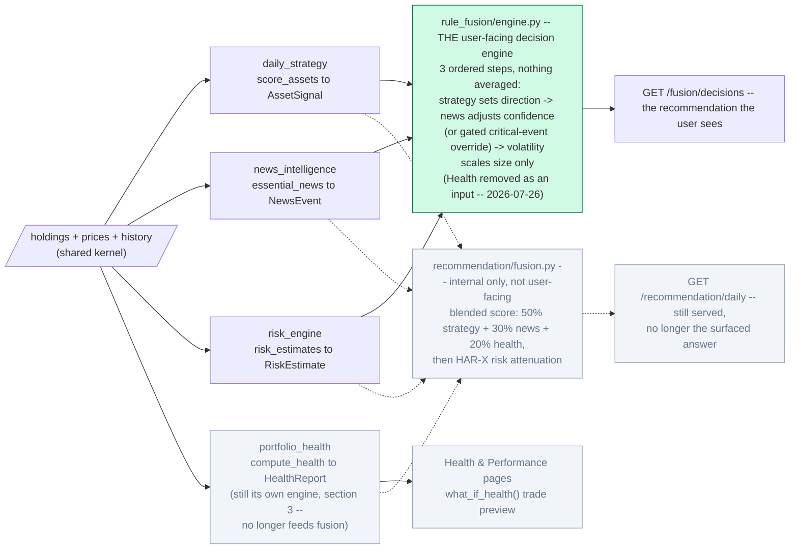
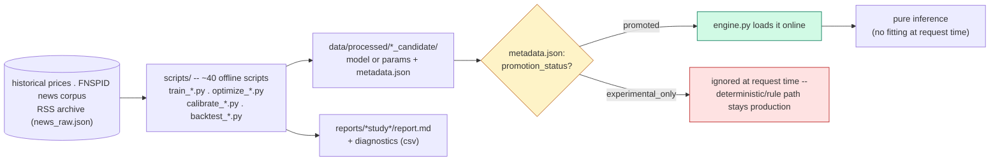

# AURORA — System Architecture (current)

_Last verified against the codebase: 2026-07-26._

> **⚠️ Status update — 2026-07-26, later the same day this doc was last
> verified:** the `rule_fusion` engine described in §2 and §3 below has been
> **deleted from the codebase**—
> `backend/src/rule_fusion/`, `backend/routers/fusion.py`, and its Streamlit
> page are gone, and git was reset to before it was added.
> `recommendation/fusion.py`'s blended score is currently the **only**
> fusion/decision engine running; `risk_engine/` was not affected and still
> exists. The `rule_fusion` material below is kept as design reference, not
> a description of what's live. **This document will be updated once the
> team integrates a new, better-performing fusion engine** in its place.

## Why this document exists

`docs/Architecture.md` is the original product spec. Its per-section formulas
(§4 Health Score, §5 regime/percentile scoring, §6 news classification, §7
market-volatility factor) are still cited as the baseline definitions inside
several engines' code and READMEs — that part hasn't gone stale.

What **has** gone stale is its top-level system diagram: one dashboard, three
engines (Portfolio / Market Strategy / Event Intelligence) feeding a single
merged "Recommendation & Risk Engine." That shape no longer matches what is
running. The system that actually exists today has:

- **six** backend engines, not three — two of them (`risk_engine`,
  `rule_fusion`) added later, solo, after the original four-developer split
- **two decision-layer philosophies that coexist on purpose**
  (`recommendation/fusion.py`'s blended score vs. `rule_fusion`'s
  staged, never-averaged ledger) — not one merged engine
- **two independent HTTP-only frontends** (Streamlit + Next.js), not one
  dashboard
- a whole **offline research pipeline** (`scripts/` → `data/processed/` →
  `reports/`) with a promotion-gate pattern that Architecture.md never
  describes, because no trained model existed yet when it was written

This document replaces the *architecture* picture. For formulas, contracts,
and definitions-of-done, the deeper sources of truth remain: `CLAUDE.md`,
`backend/src/interfaces.py`, and each engine's own `README.md`.

## System at a glance

| | |
|---|---|
| Backend engines | 6 (4 original + 2 solo-added) + 1 non-contract auxiliary module |
| Frontends | 2 — Streamlit (`frontend/`, port 8501) + Next.js 16 (`frontendjs/`, port 3000) |
| Backend API | FastAPI, `backend/`, port 8000, 9 routers |
| Offline research scripts | ~40 standalone scripts in `scripts/` |
| Offline study write-ups | ~19 subdirectories in `reports/` |
| Trained artifacts currently **promoted** (live) | 1 (`risk_model.json`) |
| Trained artifacts currently **experimental_only** (shelved) | 5+ (see promotion table below) |

## 1. Layered runtime architecture

```mermaid
flowchart TB
    subgraph L1[" PRESENTATION -- two independent HTTP-only frontends "]
        direction LR
        NJ["Next.js 16 - frontendjs/ - port 3000<br/>App Router: / . /portfolio . /health . /strategy<br/>/news . /react . /performance . /risk<br/>(no /fusion page yet)"]
        ST["Streamlit - frontend/ - port 8501<br/>app.py Home + pages/1-7<br/>(only UI that exposes Rule Fusion, page 7)"]
    end

    subgraph L2[" API -- FastAPI, backend/main.py - port 8000 "]
        direction LR
        RTK["market.py<br/>portfolio.py<br/>(shared-kernel routers)"]
        RTA["analysis.py<br/>(auxiliary, /analysis/explore)"]
        RTE["health.py . strategy.py . news.py<br/>recommendation.py . risk.py . fusion.py"]
    end

    subgraph L3[" DOMAIN -- six owned engines, backend/src/ "]
        direction LR
        HEALTH["portfolio_health<br/>Dev 1<br/>compute_health<br/>what_if_health"]
        STRAT["daily_strategy<br/>Dev 2<br/>classify_regime<br/>score_assets . backtest"]
        NEWS["news_intelligence<br/>Dev 3<br/>fetch_headlines<br/>essential_news<br/>sentiment_features"]
        RECO["recommendation<br/>Dev 4<br/>fusion . decision . llm_client<br/>gated_news . engine"]
        RISK["risk_engine<br/>solo, later<br/>risk_estimate(s)<br/>portfolio_risk"]
        RFUS["rule_fusion<br/>solo, later<br/>decide . fuse . rank"]
    end

    subgraph L4[" SHARED KERNEL -- read-only from every engine "]
        direction LR
        IF["interfaces.py<br/>frozen contract types"]
        PF["portfolio.py<br/>holdings CSV + valuation"]
        DL["data_loader.py<br/>tickers / prices / history"]
        CFG["config.py<br/>AURORA_DATA_DIR"]
    end

    subgraph L5[" DATA & EXTERNAL SERVICES "]
        direction LR
        DATA[("data/<br/>portfolio.csv . news_raw.json<br/>processed/ artifacts")]
        RSS(["RSS feeds"])
        ANTH(["Anthropic API<br/>(news LLM)"])
        DEEPS(["DeepSeek API<br/>(explanation text)"])
        YF(["Yahoo Finance"])
        NASD(["NASDAQ Trader<br/>symbol directory"])
    end

    L1 -->|HTTP| L2 --> L3 --> L4 --> L5

    style L1 fill:#EDF5FD,stroke:#4A5568
    style L2 fill:#EAF6EC,stroke:#4A5568
    style L3 fill:#FFF7E6,stroke:#4A5568
    style L4 fill:#F5EDFB,stroke:#4A5568
    style L5 fill:#FDEEEE,stroke:#4A5568

    classDef solo fill:#fde2e2,stroke:#c53030,color:#742a2a;
    class RISK,RFUS solo;
```



Two rules enforce the split between layers 1 and 2: no `streamlit` import
anywhere under `backend/`, no `src` import anywhere under `frontend/`. Layer 4
is read-only from inside any engine folder — changes there are cross-cutting
and must be flagged explicitly, never made silently.

## 2. Decision fan-in — one fusion engine reaches the user

> **Update, 2026-07-26 (after the section below was written):** `rule_fusion`
> — the engine this section names as the one reaching the user — has since
> been deleted from the codebase. See the status
> note at the top of this document. `recommendation/fusion.py` is the only
> fusion engine currently live.

Four signal engines exist upstream (`daily_strategy`, `news_intelligence`,
`portfolio_health`, `risk_engine`). The codebase contains **two**
independently designed fusion implementations that consume them —
`recommendation/fusion.py`'s blended score (still all four signals) and
`rule_fusion/engine.py`'s staged, never-averaged ledger — but the product
decision, as of 2026-07-26, is to surface only **one** of them to the user:
**`rule_fusion`** (tentative — see the caveat below the diagram). That is a
product/presentation decision, not a code deletion: `recommendation/fusion.py`
still runs, still serves its endpoint, and `decision.py` / `llm_client.py` /
`gated_news.py` still sit downstream of it.

**Also as of 2026-07-26 — confirmed with the team:** Portfolio Health is
being dropped as an input to the user-facing fusion stage entirely. `rule_fusion`
now fans in from **three** signals, not four — strategy, news, and risk/volatility.
Health isn't deleted from the system: it remains its own engine (§3), still
computes the Health Score, and still powers the Health and Performance pages
and `what_if_health()`'s trade preview — it simply no longer feeds the fused
recommendation.



**Why this one:** a blended numeric score cannot answer "which input caused
this recommendation?" by construction — averaging destroys that information.
`rule_fusion` answers it directly: every adjustment is a ledger row with a
named cause, so the confidence the user sees is always traceable back to
whichever signal moved it.

**Caveat:** "tentative" is doing real work in that sentence above — this is
the current product direction, not a settled, permanent split. If the two
are ever reconciled for real, that is a Developer 4 decision (per
`rule_fusion`'s own README), and this section should be updated alongside it.

News itself still has two timescales feeding different engines: **fast**
(live `essential_news()` events flow straight into Step 2 of the ledger) and
**slow** (`sentiment_features()` produces a look-ahead-safe training table
that is an *optional* input to `daily_strategy.score_assets()`, validated
only with walk-forward splits).

### Poster version (implementation-free)

Same fan-in, described the way a user or a poster reader would encounter it
— no file names, module names, or endpoints, in the spirit of
`docs/hdbrain_ai_architecture.png`.

```text
 INPUT SIGNALS -- recomputed fresh every time a holding is evaluated
 --------------------------------------------------------------------------
     [ STRATEGY ]             [ NEWS ]               [ RISK LEVEL ]
     Trend read on this       Today's headline        How risky is this
     holding: Buy / Add /     tone on this holding,    holding right now:
     Trim / Sell / Hold       incl. an urgent-event    a 0-100 percentile
                              override
          |                        |                        |
          +------------------------+------------------------+
                                    |
                                    v
 --------------------------------------------------------------------------
 FUSION -- one engine, three ordered steps, nothing ever averaged together
 --------------------------------------------------------------------------
  STEP 1   Strategy sets the DIRECTION and a starting confidence.
  STEP 2   News moves CONFIDENCE only -- and can flip direction ONLY
           through a rare, triple-gated "critical event" override
           (loud enough, relevant enough, important enough, all three
           at once).
  STEP 3   Risk / Volatility scales POSITION SIZE only. It never
           touches direction or confidence.

  Every step writes one line to a visible ledger -- the final answer
  is never a black-box score, it is always traceable back to the
  specific input that caused it.

  Note: Portfolio Health is deliberately NOT an input here (dropped
  2026-07-26). It is still computed elsewhere and still shown to the
  user as its own number -- it just no longer changes this decision.
                                    |
                                    v
 --------------------------------------------------------------------------
 RECOMMENDATION -- one decision per holding
 --------------------------------------------------------------------------
  Action       New Buy / Add / Trim / Close / Hold
  Confidence   0-100%, built from the ledger above
  Risk band    Low / Moderate / Elevated / High -- with every
               contributing driver named, not folded into one number
```

Three inputs in, one rule for how they combine (never average, always
attribute), one accountable output. That's the whole pitch — everything
above this box is where the three numbers come from; everything in it is how
they turn into an action.

## 3. The six engines

### 🏥 Portfolio Health — `portfolio_health/` (Dev 1)

**As of 2026-07-26, its score is no longer an input to the user-facing fusion
decision** (`rule_fusion` — see §2; a confirmed, not-yet-coded team decision).
It continues to do everything below on its own.

**Purpose:** "How healthy is this portfolio — and does the Health Score
actually mean anything?"

- Annualized return, volatility, Sharpe, Sortino, max drawdown, beta
- Diversification and concentration (single-asset + sector, via yfinance info)
- A 0–100 Health Score, **empirically validated**: computed on rolling
  historical windows across many random portfolios, checked against forward
  drawdown/Sharpe, and calibrated from that evidence — not asserted
- `what_if_health()` previews the score after a proposed trade (the "Health
  68 → 73 if you accept this" line other engines quote)
- Also owns the Performance & Benchmark page, presenting Dev 2's backtest curves

**Technique:** quant formulas + an empirical validation study (no ML).
**Signal:** `HealthReport`.

### 📈 Daily Strategy — `daily_strategy/` (Dev 2)

**Purpose:** "Given market conditions, should the allocation change?"

- Regime classification (4 regimes) from historical OHLCV
- Per-asset scoring from technical indicators: momentum, price-vs-SMA50/200,
  rolling volatility, RSI, drawdown, beta
- Rule-based scoring is the production path today. `learned.py`'s XGBoost
  residual-alpha candidate is `experimental_only` — it failed validation
  consistency, diagnostic significance, and 2024–2026 external generalization
- Optional news-sentiment channel, left-joined and look-ahead-safe, validated
  with a walk-forward price-only vs. price+news ablation (never a random shuffle)
- `backtest()` returns buy_hold / equal_weight / rule-based / ML columns for
  Dev 1's Performance page

**Technique:** rule-based baseline (production) + scikit-learn walk-forward
ML candidate. **Signal:** `RegimeState` + `List[AssetSignal]`.

### 📰 News Intelligence — `news_intelligence/` (Dev 3)

**Purpose:** two deliverables on two timescales — live essential-news
filtering, and a historical sentiment feature table for Dev 2's ML.

- `collector.py` (standalone process): RSS → dedupe → `data/news_raw.json`;
  run regularly, since RSS has no archive
- **Live:** one batched Anthropic LLM call per refresh cycle (structured
  output via a Pydantic schema) classifies deduped headlines against the
  user's holdings into ≤5 essential `NewsEvent`s/day; falls back to
  keyword-rule classification if `ANTHROPIC_API_KEY` is missing or the call fails
- **Historical:** a local model (FinBERT/VADER — *not* the paid API, to avoid
  billing per headline) scores a large ticker-mapped corpus (FNSPID etc.),
  aggregated per symbol-day into `sentiment_features`, strictly no look-ahead

**Technique:** LLM (live) + FinBERT/VADER (batch, local).
**Signal:** `List[NewsEvent]` (live) / `sentiment_features` DataFrame (training).

### 🧭 Recommendation — `recommendation/` (Dev 4)

**Purpose:** turn strategy + news + health (+ risk) into an actual trade
recommendation. Grew past a single `engine.py` into four modules plus a
legacy fallback:

- `fusion.py` — blended score (50% strategy / 30% news / 20% health) → HAR-X
  risk attenuation, which can only pull the score toward neutral, never cast
  a bearish vote of its own. Strategy/news conflict forces Hold; stale or
  unavailable inputs are explicit in the output. Still runs, still served —
  but as of 2026-07-26 it is no longer the engine surfaced to the user as
  *the* recommendation; see §2's decision fan-in.
- `decision.py` — a constrained-optimizer path (long-only, fully invested,
  transaction-cost-aware) that layers in a next-20-session return-model
  candidate; if that candidate isn't promoted, the optimizer runs with
  expected alpha set to zero
- `gated_news.py` — a confidence-gated news-residual candidate on top of the
  Daily Strategy prior; `experimental_only`, so news today still affects the
  formal decision only through risk/covariance/sizing, not a direct
  directional vote
- `llm_client.py` — DeepSeek explanation-only text on an already-fixed
  numeric decision; a deterministic template stands in if the key is missing,
  the call fails, or the response doesn't validate
- `engine.py` — legacy event-reaction (`reaction_risk`) and the final
  fallback path

**Technique:** rule-based fusion (production) + constrained optimization +
gated ML candidate + LLM explanation layer.
**Signal:** `Recommendation` / `ProposedTrade` / `ReactionRisk`.

### ⚠️ Risk Engine — `risk_engine/` (solo, added later)

**Purpose:** decision-ready, calibrated, fat-tail-aware downside-risk
numbers, as pure online inference for a formula-based decision layer.

- **Offline (already done):** a pooled HAR model on log realized volatility,
  components selected under a min-gain ablation (leverage/news rejected
  out-of-sample); a Filtered-Historical-Simulation tail for VaR/ES/band.
  Validated: causal news attention improves 5-session OOF QLIKE by 5.24%
  (2018–2023, 95% CI +2.38–8.83%, DM p=0.0011); VaR-95 breach 4.32%; band
  coverage 96.34%.
- **Online:** a dot product for σ̂ plus a table lookup for FHS quantiles —
  no training, no per-stock refitting at request time.
- `risk_level` (0–100) = percentile of current σ̂ against the symbol's own
  history.

Unlike every other candidate in this system, `risk_model.json` isn't gated
behind a `promotion_status` check — it *is* the only inference path; there's
no deterministic fallback to fall back to.

**Technique:** HAR-News volatility model + Filtered Historical Simulation.
**Signal:** `RiskEstimate` (per symbol × horizon) / `PortfolioRisk`.

### 🧩 Rule Fusion — `rule_fusion/` (solo, added later)

> **⚠️ Deleted from the codebase, 2026-07-26 (same day, after this section
> was written)** ; git was reset to before
> it was added. Kept below as design reference until a replacement fusion
> engine is integrated — see the status note at the top of this document.

**As of 2026-07-26, this is the single fusion engine the product surfaces to
the user** (tentative product decision — see §2's caveat). Everything below
describes what that engine actually does.

**Pending change, confirmed with the team on 2026-07-26: Health is being
removed as an input entirely** (see §2). The bullets, the step count, and
`scripts/fusion_selfcheck.py`'s invariants below still describe the engine as
it exists in `backend/src/rule_fusion/engine.py` / `README.md` **today**,
which still has Health as Step 3 — that code hasn't been changed yet. Once it
is: delete the Health step, renumber Volatility from Step 4 to Step 3, drop
Health from `FusionInputs`, and update INV-1 in `scripts/fusion_selfcheck.py`
(and the engine's own README, which documents the same steps in far more
detail — exact formulas, the full invariant grid, the fusion.py comparison
table — none of which is reproduced here).

**Purpose (current code):** the same four inputs as `fusion.py` — strategy,
news, health, risk — staged instead of blended, so every output is traceable
back to the input that caused it. **Purpose (target, pending the change
above):** the same, minus health — three inputs, three steps.

- Four ordered steps *today*, each touching exactly one output dimension:
  strategy sets direction + base confidence → news adjusts confidence only
  (or overrides direction, but only through a triple-gated critical-event
  path) → health adjusts confidence only, never direction → volatility
  percentile scales position size only, never direction or confidence.
  **Target (pending):** the health step is deleted outright — three steps,
  not four skipped-and-renumbered.
- `decide()` is pure (no I/O, deterministic); `scripts/fusion_selfcheck.py`
  restates the rules as five invariants and checks them over a ~10,000-case
  scenario grid — it exits non-zero the moment the engine stops obeying its
  own rules
- **Actively being calibrated right now:** `scripts/calibrate_rule_fusion.py`
  (2026-07-25) ran a walk-forward search over the rule's *magnitudes only*
  (never its routing). Result: `experimental_only` — out-of-sample gain
  wasn't positive on all three folds, so the hand-set default parameters
  stay live in production (see the promotion table below)
- Deliberately coexists with `recommendation/fusion.py` — "a different
  design, not a duplicate"; reconciling the two, if it ever happens, is a
  Dev 4 call, and this folder does not touch `recommendation/`

**Technique:** staged rule ledger, no ML, nothing averaged; an offline
calibration search tunes magnitudes only. **Signal:** `FusionDecision` per
holding, via `GET /fusion/decisions`.

### Auxiliary: `analysis/` (no owner, not a contract engine)

Calendar alignment, constant-mix portfolio construction, and risk/performance
stats — ported from `frontendjs`' old `src/lib/metrics.ts`. Serves only
`POST /analysis/explore`, which backs the Next.js `/portfolio` page's
analytics tab. No Streamlit page uses it.

## 4. Offline research pipeline: train → validate → promote → infer



Nothing under `scripts/`, `reports/`, or `data/processed/` runs as part of
the live app — `engine.py` files only ever read the finished artifacts, and
only after checking `metadata.json`. **Never assume a trained artifact is
live just because it exists on disk.**

### What's actually live right now

| Candidate | Engine | Status | Why |
|---|---|---|---|
| `risk_model.json` | `risk_engine` | **live** (not gated) | only inference path; HAR-News validated OOS, see above |
| `daily_strategy_model_candidate` | `daily_strategy` | `experimental_only` | XGBoost residual failed validation consistency + 2024–2026 generalization |
| `decision_model_candidate*` (ceiling / mlp) | `recommendation` (`decision.py`) | `experimental_only` | production = deterministic optimizer, alpha = 0 |
| `decision_model_candidate_gated_news` | `recommendation` (`gated_news.py`) | `experimental_only` | production = Daily Strategy prior + external risk control only |
| `rule_fusion_params_candidate` | `rule_fusion` | `experimental_only` (as of 2026-07-25) | OOS gain negative on all 3 walk-forward folds; locked-2023 agreed but that alone isn't enough — hand-set defaults stay live |

## 5. Ownership map

| Engine | Owner | Folder | Router | Frontend view(s) |
|---|---|---|---|---|
| Portfolio Health | Dev 1 | `backend/src/portfolio_health/` | `routers/health.py` | `frontend/views/portfolio_health.py` (Health + Performance); `frontendjs` `/health`, `/performance` |
| Daily Strategy | Dev 2 | `backend/src/daily_strategy/` | `routers/strategy.py` | `frontend/views/daily_strategy.py`; `frontendjs` `/strategy` |
| News Intelligence | Dev 3 | `backend/src/news_intelligence/` | `routers/news.py` | `frontend/views/news_intelligence.py`; `frontendjs` `/news` |
| Recommendation | Dev 4 | `backend/src/recommendation/` | `routers/recommendation.py` | `frontend/views/recommendation.py` (Should I React); `frontendjs` `/react` |
| Risk Engine | solo | `backend/src/risk_engine/` | `routers/risk.py` | `frontend/views/risk.py`; `frontendjs` `/risk` |
| Rule Fusion | solo | `backend/src/rule_fusion/` | `routers/fusion.py` | `frontend/views/fusion.py` (Streamlit page 7 only — **no Next.js page yet**) |
| Analysis (auxiliary) | — | `backend/src/analysis/` | `routers/analysis.py` | `frontendjs` `/portfolio` analytics tab only |
| Shared kernel | all, read-only | `interfaces.py`, `data_loader.py`, `portfolio.py`, `config.py` | `routers/market.py`, `routers/portfolio.py` | `app.py` Home / portfolio builder |

Rule: cross-engine calls go through public contract functions only, never
private helpers; the shared kernel is read-only from inside any engine
folder; changes there are cross-cutting and must be flagged explicitly.

## 6. Also in this repo, not part of the engine model

- `ui_design/` — an earlier, superseded Next.js attempt at the same UI.
  Explicitly marked dead by its own last commit. Don't edit it.
- `docs/architecture-layered.puml` (+ rendered `.png`/`.svg`) — an earlier
  PlantUML `@startdot` rendering of layers 1–2 and the *original four*
  engines only. Predates `risk_engine`, `rule_fusion`, and the offline
  pipeline described above; kept for reference, superseded by §1 here.
- `docs/arch.md` / `docs/arch.puml` — the user's own working notes; not
  touched by this document.

## Further reading

- `CLAUDE.md` — commands, environment variables, ownership rules
- `backend/src/interfaces.py` — the frozen cross-engine contract
- `backend/src/<engine>/README.md` — mission, contract, and
  definition-of-done per engine
- `docs/Architecture.md` — original formula appendices (§4–§7), still cited
  by engine code for baseline definitions
