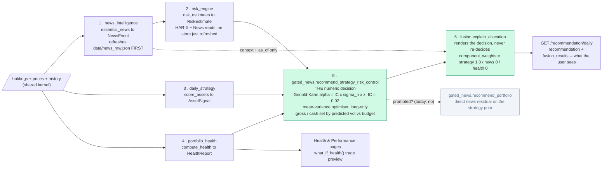
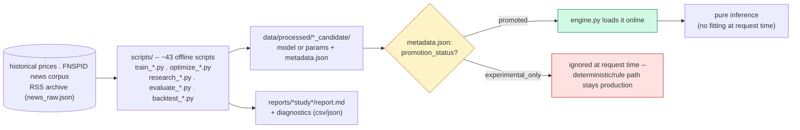

# AURORA — System Architecture (current)

_Last verified against the codebase: 2026-07-26 (commit `c2233a3`, "final fusion")._

## Status in three statements

**What is live.** One decision path, served by `GET /recommendation/daily`:
`gated_news.recommend_strategy_risk_control()`. Daily Strategy sets direction
and all relative stock weights; HAR-X + News risk sets per-stock size, gross
exposure and cash; Portfolio Health sets the risk budget. News reaches the
decision only through the risk forecast. One trained artifact is promoted —
`risk_model.json` — and everything else on the live path is deterministic.

**What is explanation-only.** `fusion.explain_allocation()`. It reads the
decision that was already made and renders one auditable record per holding.
It computes no allocation, casts no vote, and cannot change a trade; if it
raises, the recommendation still ships without it. Fusion describes — it does
not decide.

**What is retired or experimental.** *Retired:* the `rule_fusion` staged-ledger
engine (deleted from the codebase) and `fusion.py`'s older 50/30/20 blended
path (still in the module, called by no router). *Experimental:* the direct
news-residual directional vote, the XGBoost strategy residual, the
return-model candidates, and all three fusion allocation overlays written up
in `reports/`. None of them is loaded at request time, and the live path works
without any of them.

## Why this document exists

`docs/Architecture.md` is the original product spec. Its per-section formulas
(§4 Health Score, §5 regime/percentile scoring, §6 news classification, §7
market-volatility factor) are still cited as the baseline definitions inside
several engines' code and READMEs — that part hasn't gone stale.

What **has** gone stale is its top-level system diagram: one dashboard, three
engines (Portfolio / Market Strategy / Event Intelligence) feeding a single
merged "Recommendation & Risk Engine." That shape no longer matches what is
running. The system that actually exists today has:

- **five** backend engines, not three — one of them (`risk_engine`) added
  later, solo, after the original four-developer split
- **one** user-facing decision path, in which fusion is an *explanation*
  layer over an already-fixed numeric decision, not a second opinion that
  re-scores it (§2)
- **two independent HTTP-only frontends** (Streamlit + Next.js), not one
  dashboard
- a whole **offline research pipeline** (`scripts/` → `data/processed/` →
  `reports/`) with a promotion-gate pattern that Architecture.md never
  describes, because no trained model existed yet when it was written

This document replaces the *architecture* picture. For formulas, contracts,
and definitions-of-done, the deeper sources of truth remain: `CLAUDE.md`,
`backend/src/interfaces.py`, and each engine's own `README.md`.

## System at a glance

| | |
|---|---|
| Backend engines | 5 (4 original + `risk_engine`, solo-added) + 1 non-contract auxiliary module |
| Frontends | 2 — Streamlit (`frontend/`, port 8501) + Next.js 16 (`frontendjs/`, port 3000) |
| Backend API | FastAPI, `backend/`, port 8000, 8 routers |
| Offline research scripts | ~43 standalone scripts in `scripts/` |
| Offline study write-ups | 17 subdirectories + 5 standalone reports in `reports/` |
| Trained artifacts currently **promoted** (live) | 1 (`risk_model.json`) |
| Trained artifacts currently **experimental_only** (shelved) | 4+ (see promotion table below) |

## 1. Layered runtime architecture

```mermaid
flowchart TB
    subgraph L1[" PRESENTATION -- two independent HTTP-only frontends "]
        direction LR
        NJ["Next.js 16 - frontendjs/ - port 3000<br/>App Router: / . /portfolio . /health . /strategy<br/>/news . /react . /performance . /risk"]
        ST["Streamlit - frontend/ - port 8501<br/>app.py Home + pages/1-6<br/>(page 4 'Should I React' is the only UI that<br/>renders the per-asset fusion explanation)"]
    end

    subgraph L2[" API -- FastAPI, backend/main.py - port 8000 "]
        direction LR
        RTK["market.py<br/>portfolio.py<br/>(shared-kernel routers)"]
        RTA["analysis.py<br/>(auxiliary, /analysis/explore)"]
        RTE["health.py . strategy.py . news.py<br/>recommendation.py . risk.py"]
    end

    subgraph L3[" DOMAIN -- five owned engines, backend/src/ "]
        direction LR
        HEALTH["portfolio_health<br/>Dev 1<br/>compute_health<br/>what_if_health"]
        STRAT["daily_strategy<br/>Dev 2<br/>classify_regime<br/>score_assets . backtest"]
        NEWS["news_intelligence<br/>Dev 3<br/>fetch_headlines<br/>essential_news<br/>sentiment_features"]
        RECO["recommendation<br/>Dev 4<br/>gated_news . fusion<br/>decision . llm_client . engine"]
        RISK["risk_engine<br/>solo, later<br/>risk_estimate(s)<br/>portfolio_risk"]
    end

    subgraph L4[" SHARED KERNEL -- read-only from every engine "]
        direction LR
        IF["interfaces.py<br/>frozen contract types"]
        PF["portfolio.py<br/>holdings CSV + valuation"]
        DL["data_loader.py<br/>tickers / prices / history"]
        CFG["config.py<br/>AURORA_DATA_DIR"]
    end

    subgraph L5[" DATA & EXTERNAL SERVICES "]
        direction LR
        DATA[("data/<br/>portfolio.csv . news_raw.json<br/>processed/ artifacts")]
        RSS(["RSS feeds"])
        FINB(["FinBERT<br/>(local, news sentiment)"])
        DEEPS(["DeepSeek API<br/>(fallback explanation text)"])
        YF(["Yahoo Finance"])
        NASD(["NASDAQ Trader<br/>symbol directory"])
    end

    L1 -->|HTTP| L2 --> L3 --> L4 --> L5

    style L1 fill:#EDF5FD,stroke:#4A5568
    style L2 fill:#EAF6EC,stroke:#4A5568
    style L3 fill:#FFF7E6,stroke:#4A5568
    style L4 fill:#F5EDFB,stroke:#4A5568
    style L5 fill:#FDEEEE,stroke:#4A5568

    classDef solo fill:#fde2e2,stroke:#c53030,color:#742a2a;
    class RISK solo;
```



Two rules enforce the split between layers 1 and 2: no `streamlit` import
anywhere under `backend/`, no `src` import anywhere under `frontend/`. Layer 4
is read-only from inside any engine folder — changes there are cross-cutting
and must be flagged explicitly, never made silently.

## 2. Decision fan-in — one decision path, one explanation layer

`GET /recommendation/daily` is the single user-facing decision endpoint. Its
defining property is that **fusion does not decide anything**. A risk-controlled
optimiser (`gated_news.recommend_strategy_risk_control`) produces the numbers;
`fusion.explain_allocation()` then renders exactly those numbers as one
auditable record per holding. Because the explanation is derived from the
decision rather than computed in parallel with it, the table the user reads
and the trades the system proposes can never disagree.

Each input touches exactly one thing:

| Input | What it controls | What it never does |
|---|---|---|
| **Daily Strategy** | direction, and 100% of the relative stock weights | — |
| **HAR-X + News risk** | covariance, per-stock sizing, risky gross exposure, cash | vote on direction |
| **Portfolio Health** | the volatility budget and risk aversion | vote on direction |
| **News** | reaches the decision *only* through the risk forecast | cast a directional vote |



**Ordering is load-bearing.** News is collected *before* risk is estimated,
not after. The HAR-X model derives its causal news-attention input
(`log_count`) from `data/news_raw.json`; refreshing the store after the risk
call would make the model score the previous request's headlines — a full
cycle of lag, and no news overlay at all on a cold start. `/recommendation/daily`
gets this by calling `essential_news()` first (which collects); `/risk/*` gets
it from `routers/_common.refresh_news_store()`. The collector throttles per
feed, so the call costs nothing when the store is warm.

**Why news doesn't vote on direction.** It could, technically —
`gated_news.py` implements a confidence-gated news residual on top of the
Daily Strategy prior. That candidate is `experimental_only`, and the daily
endpoint only loads it when `metadata.json` says `promoted`. Until then news
still changes the formal output, through estimated volatility, covariance,
gross exposure and cash — the channel that *is* validated — rather than
through an unvalidated directional vote. `component_weights` records the split
explicitly rather than leaving it implied.

**Why the tilts are small.** The optimiser needs Daily Strategy's direction
rank expressed as an expected return, and that conversion is where an
unvalidated signal does the most damage. It now uses Grinold-Kahn,
`alpha = IC × σ_horizon × z(direction)`, with
`STRATEGY_INFORMATION_COEFFICIENT = 0.02`. That replaced a hardcoded
`direction × 0.010`, which implied an IC near **0.14** — roughly ten times any
measured value (measured rank IC is +0.010/+0.029 on the 21-symbol panel with
t ≈ 0.8/1.2, and −0.010/−0.009 on the 165-symbol wide panel). The asymmetry is
deliberate: being too conservative costs ~0.25 Sharpe when the signal is real;
being too aggressive costs ~0.25 Sharpe **and** 1.9%/yr in fees when it isn't.

**Confidence means reproducibility, not certainty.** `explain_allocation`
computes `(0.45 + 0.30·|direction|) × risk_factor`, then caps it for stale
inputs (0.40), unavailable inputs (0.35), extreme volatility (0.45), and sets
it to 0 if the optimiser didn't converge. It describes how firmly the decision
follows from its inputs — the direction input itself is not statistically
distinguishable from noise, and the number does not pretend otherwise.

**Failure is contained.** The explanation step is wrapped separately from the
decision: if `explain_allocation` raises, `fusion_results` comes back empty and
`explanation_meta.fusion_error` names the exception — but the validated numeric
recommendation still ships. A presentational failure must never discard a good
decision. Below that sit two fallbacks: `decision.recommend_portfolio` (the
constrained optimiser plus a DeepSeek text explanation) and, last,
`engine.recommend_daily` (the legacy signal path).

**What was retired.** `fusion.py`'s older blended path — `recommend_portfolio()`
/ `fuse_scores()`, 50% strategy + 30% news + 20% health, then HAR-X attenuation
— is **no longer wired to any router**. It survives in the module because
`scripts/backtest_rule_fusion.py` still backtests it. A blended numeric score
cannot answer "which input caused this recommendation?" by construction:
averaging destroys that information. The current design answers it by never
letting two inputs touch the same output dimension in the first place.

### Poster version (implementation-free)

Same fan-in, described the way a user or a poster reader would encounter it
— no file names, module names, or endpoints, in the spirit of
`docs/hdbrain_ai_architecture.png`.

```text
 INPUT SIGNALS -- recomputed fresh every time the portfolio is evaluated
 --------------------------------------------------------------------------
     [ STRATEGY ]          [ NEWS ]              [ RISK LEVEL ]      [ HEALTH ]
     Trend read on          Today's headline      How risky is        How healthy
     every holding,         flow -- collected     this holding        is the whole
     ranked against         FIRST, because        right now:          portfolio
     each other             the risk model        a 0-100
                            reads it              percentile
          |                       |                     |                  |
          |                       +---------------------+                  |
          |                        news changes RISK, not direction        |
          v                                    v                          v
 --------------------------------------------------------------------------
 DECISION -- each input controls exactly one thing, and only that thing
 --------------------------------------------------------------------------
  DIRECTION    Strategy alone decides what to favour, and by how much
               relative to everything else. Its tilt is sized by its own
               MEASURED skill -- deliberately small, because that skill
               is small.

  SIZE         Risk decides how much money is exposed: per-position size,
               total invested share, and how much stays in cash. It can
               shrink a position to nothing, but it can never turn a
               "favour this" into a "sell this."

  BUDGET       Portfolio Health sets how much total volatility the
               portfolio is allowed to run. It moves the ceiling, not
               the ranking.

 --------------------------------------------------------------------------
 EXPLANATION -- written from the decision, never alongside it
 --------------------------------------------------------------------------
  The explanation layer does not re-score anything. It reads the decision
  that was actually made and says, per holding: what moved, why it moved,
  which limit stopped it, how fresh each input was, and what was missing.
  So the words and the trades cannot drift apart.

                                    |
                                    v
 --------------------------------------------------------------------------
 RECOMMENDATION -- one line per holding
 --------------------------------------------------------------------------
  Action       Increase / Small Increase / Cautious Increase / Hold /
               Small Reduction / Reduce -- describing what was done,
               not a second opinion about what should be done
  Net effect   "12.4% -> 15.1% (+2.7pp)", plus the rule that capped it
  Confidence   0-100%, meaning "how firmly does this follow from its
               inputs" -- NOT "how sure are we the price goes up"
  Risk band    Low / Moderate / High / Extreme, with stale or missing
               inputs named out loud rather than hidden
```

Four inputs in, one rule for how they combine (each touches one dimension,
nothing is averaged), one accountable output — and the explanation is a
readout of the decision, not a rival to it.

News itself still has two timescales feeding different engines: **fast**
(live `essential_news()` refreshes the store the HAR-X risk model reads, and
supplies context and `as_of` timestamps to the explanation) and **slow**
(`sentiment_features()` produces a look-ahead-safe training table that is an
*optional* input to `daily_strategy.score_assets()`, validated only with
walk-forward splits).

## 3. The five engines

### 🏥 Portfolio Health — `portfolio_health/` (Dev 1)

**Purpose:** "How healthy is this portfolio — and does the Health Score
actually mean anything?"

- Annualized return, volatility, Sharpe, Sortino, max drawdown, beta
- Diversification and concentration (single-asset + sector, via yfinance info)
- A 0–100 Health Score, **empirically validated**: computed on rolling
  historical windows across many random portfolios, checked against forward
  drawdown/Sharpe, and calibrated from that evidence — not asserted
- `what_if_health()` previews the score after a proposed trade (the "Health
  68 → 73 if you accept this" line other engines quote)
- Also owns the Performance & Benchmark page, presenting Dev 2's backtest curves

In the daily decision (§2) Health is a **budget** input, not a directional
one: it scales the volatility target and risk aversion, and never changes
which assets are favoured. The current engine is portfolio-level, so the
score is a single shared quality input across all held assets — the API
labels this `health_scope=portfolio`.

**Technique:** quant formulas + an empirical validation study (no ML).
**Signal:** `HealthReport`.

### 📈 Daily Strategy — `daily_strategy/` (Dev 2)

**Purpose:** "Given market conditions, should the allocation change?" In the
daily decision it is the **sole** source of direction and of the relative
weights between holdings.

- Regime classification (4 regimes) from historical OHLCV
- Per-asset scoring from technical indicators: momentum, price-vs-SMA50/200,
  rolling volatility, RSI, drawdown, beta
- Rule-based scoring is the production path today. `learned.py`'s XGBoost
  residual-alpha candidate is `experimental_only` — it failed validation
  consistency, diagnostic significance, and 2024–2026 external generalization
- Optional news-sentiment channel, left-joined and look-ahead-safe, validated
  with a walk-forward price-only vs. price+news ablation (never a random shuffle)
- `backtest()` returns buy_hold / equal_weight / rule-based / ML columns for
  Dev 1's Performance page

**Technique:** rule-based baseline (production) + scikit-learn walk-forward
ML candidate. **Signal:** `RegimeState` + `List[AssetSignal]`.

### 📰 News Intelligence — `news_intelligence/` (Dev 3)

**Purpose:** two deliverables on two timescales — live essential-news
filtering, and a historical sentiment feature table for Dev 2's ML.

- `collector.py` (standalone process, also called inline by the request path):
  RSS → dedupe → `data/news_raw.json`; run regularly, since RSS has no archive
- **Live:** `analyzer.py` clusters deduped headlines, categorises and maps them
  to holdings with the rules in `rules.json`, and scores sentiment with a local
  **FinBERT** (`ProsusAI/finbert`, weights cached under `<DATA_DIR>/models/`),
  falling back to keyword sentiment if the model can't load — down to ≤5
  essential `NewsEvent`s/day. A batched LLM classification pass is *designed
  for but not implemented*: `anthropic>=0.40` sits in
  `backend/requirements.txt`, but no code imports it and there is no
  `ANTHROPIC_API_KEY` code path today.
- **Historical:** a local model (FinBERT/VADER — *not* the paid API, to avoid
  billing per headline) scores a large ticker-mapped corpus (FNSPID etc.),
  aggregated per symbol-day into `sentiment_features`, strictly no look-ahead

The store this engine writes is also the risk engine's news-attention input,
which is why §2 collects news before estimating risk.

**Technique:** LLM (live) + FinBERT/VADER (batch, local).
**Signal:** `List[NewsEvent]` (live) / `sentiment_features` DataFrame (training).

### 🧭 Recommendation — `recommendation/` (Dev 4)

**Purpose:** turn strategy + risk + health into an actual trade recommendation,
and explain it. Five modules, in the order the daily path uses them:

- `gated_news.py` — **the production decision.**
  `recommend_strategy_risk_control()` runs a long-only mean-variance optimiser
  in which Daily Strategy supplies direction (scaled by
  `strategy_alpha()`'s Grinold-Kahn conversion, IC = 0.02), HAR-X + News
  supplies covariance, per-stock sizing, risky gross exposure and cash, and
  Health scales only the risk budget. `recommend_portfolio()` — the same path
  plus a direct confidence-gated news residual — runs only if its checkpoint
  is `promoted`; today it is `experimental_only`, so news reaches the decision
  through risk alone. Per-symbol metadata now also surfaces
  `risk_news_quality`, so a broken RSS feed is visible downstream instead of
  looking like a calm market.
- `fusion.py` — **the production explanation.** `explain_allocation()` takes
  the optimiser's metadata and renders one `AssetFusionResult` per holding:
  AURORA score, outlook, action (describing what the optimiser *did*),
  reproducibility-style confidence, the named binding constraint, per-input
  `as_of` timestamps, and explicit stale/unavailable lists. It computes no
  allocation of its own. Also still hosts the retired blended path
  (`recommend_portfolio()` / `fuse_scores()`, 50/30/20 + risk attenuation),
  which no router calls and only `scripts/backtest_rule_fusion.py` exercises.
- `decision.py` — first fallback: a constrained-optimizer path (long-only,
  fully invested, transaction-cost-aware) that layers in a next-20-session
  return-model candidate; if that candidate isn't promoted, the optimizer runs
  with expected alpha set to zero
- `llm_client.py` — DeepSeek explanation-only text on an already-fixed
  numeric decision, used on the fallback path; a deterministic template stands
  in if the key is missing, the call fails, or the response doesn't validate
- `engine.py` — legacy event-reaction (`reaction_risk`, `recommend_event`,
  `apply_constraints`) and the final fallback path

**Technique:** constrained mean-variance optimisation (production) + a gated
ML candidate + a deterministic explanation layer + an LLM explanation layer on
the fallback. **Signal:** `Recommendation` / `ProposedTrade` / `ReactionRisk`,
plus `fusion_results[]` on `/recommendation/daily`.

### ⚠️ Risk Engine — `risk_engine/` (solo, added later)

**Purpose:** decision-ready, calibrated, fat-tail-aware downside-risk
numbers, as pure online inference for a formula-based decision layer.

- **Offline (already done):** a pooled HAR model on log realized volatility,
  components selected under a min-gain ablation (leverage/news rejected
  out-of-sample); a Filtered-Historical-Simulation tail for VaR/ES/band.
  Validated: causal news attention improves 5-session OOF QLIKE by 5.24%
  (2018–2023, 95% CI +2.38–8.83%, DM p=0.0011); VaR-95 breach 4.32%; band
  coverage 96.34%.
- **Online:** a dot product for σ̂ plus a table lookup for FHS quantiles —
  no training, no per-stock refitting at request time.
- `risk_level` (0–100) = percentile of current σ̂ against the symbol's own
  history.
- **Observed zero vs. unknown.** An *observed* zero news count is a real news
  state and passes through the joint model. A *degraded* store
  (`missing_store` / `stale_store` / `invalid_store`) is not an observed zero:
  those qualities no longer count as the news channel having been applied, so
  `news_applied` is `False` and the quality string reaches the caller.
  Numerically nothing changes — the calibrated multiplier at `log_count = 0`
  is exactly 1.0, so a degraded store already produced the price-only HAR
  sigma. Nothing is imputed: inventing attention to fail conservative would
  fabricate an input the model never observed.
- **Callers must refresh the store before estimating** — see §2.

Unlike every other candidate in this system, `risk_model.json` isn't gated
behind a `promotion_status` check — it *is* the only inference path; there's
no deterministic fallback to fall back to.

**Technique:** HAR-News volatility model + Filtered Historical Simulation.
**Signal:** `RiskEstimate` (per symbol × horizon) / `PortfolioRisk`.

### Auxiliary: `analysis/` (no owner, not a contract engine)

Calendar alignment, constant-mix portfolio construction, and risk/performance
stats — ported from `frontendjs`' old `src/lib/metrics.ts`. Serves only
`POST /analysis/explore`, which backs the Next.js `/portfolio` page's
analytics tab. No Streamlit page uses it.

## 4. Offline research pipeline: train → validate → promote → infer



Nothing under `scripts/`, `reports/`, or `data/processed/` runs as part of
the live app — `engine.py` files only ever read the finished artifacts, and
only after checking `metadata.json`. **Never assume a trained artifact is
live just because it exists on disk.**

### The fusion research line

Three studies, in order, each superseding the last. All three are **allocation
overlays** evaluated offline; none is promoted, and none is what
`/recommendation/daily` runs today. They are the argument for why production
looks the way it does.

| Study | Report | Method | Verdict |
|---|---|---|---|
| Adaptive / 75-25 guardrail | `reports/adaptive_fusion_design.md` | 75% neutral + 25% Strategy target, projected onto a causal stress-driven vol ceiling | **Rejected.** Locked 2024–2026 forward test lost 16.9pp CAGR vs Daily Strategy; P(ΔSharpe > 0) = 6.4% |
| Generalization retune | `reports/fusion_generalization_report.md` | Keeps **100% of Strategy's relative weights**; risk may change only uniform gross exposure, driven by a systemic (not idiosyncratic) stress score | Fixed the architectural failure — recovered 14.5pp CAGR and 0.21 Sharpe vs the guardrail — but stays `experimental_only`: the 2024–2026 window was inspected while tuning |
| Shock-confirmed V-recovery | `reports/regime_gated_fusion_report.md` | Adds a sparse, strictly gross-only recovery state after a confirmed ≥8% shock; relative-weight deviation < 1e-16 | Selected **shadow candidate**. Beats the gross-only overlay on CAGR/Sharpe/Calmar in all three samples, but bootstrap intervals still include zero |

The diagnosis that carried into production: the old design let risk do two
things at once — hold cash *and* rewrite Strategy's cross-sectional weights —
and treating high idiosyncratic volatility as a systemic crisis kept gross
exposure near 41–73% through the April–May 2025 rebound. That is exactly the
separation the live path now enforces (§2): Strategy owns direction, risk owns
size.

Before any of these is promoted, the bar set in
`adaptive_fusion_design.md` applies: a new locked period or paper-trading
archive, paired Sharpe/CER intervals excluding zero, drawdown no worse than
current by more than 5pp, preserved stress-episode protection, no material
cost increase, and explicit metadata. The V-recovery candidate additionally
needs portfolio-basket execution semantics and persisted causal state.

### What's actually live right now

| Candidate | Engine | Status | Why |
|---|---|---|---|
| `risk_model.json` | `risk_engine` | **live** (not gated) | only inference path; HAR-News validated OOS, see §3 |
| `daily_strategy_model_candidate` | `daily_strategy` | `experimental_only` | XGBoost residual failed validation consistency + 2024–2026 generalization |
| `decision_model_candidate*` (ceiling / mlp) | `recommendation` (`decision.py`) | `experimental_only` | production = deterministic optimizer, alpha = 0 |
| `decision_model_candidate_gated_news` | `recommendation` (`gated_news.py`) | `experimental_only` | production = Daily Strategy prior + external HAR-X + News risk control only |
| fusion allocation overlays (gross-only, V-recovery) | research only | **not an artifact** | report-and-script only; see the fusion research line above |

## 5. Ownership map

| Engine | Owner | Folder | Router | Frontend view(s) |
|---|---|---|---|---|
| Portfolio Health | Dev 1 | `backend/src/portfolio_health/` | `routers/health.py` | `frontend/views/portfolio_health.py` (Health + Performance); `frontendjs` `/health`, `/performance` |
| Daily Strategy | Dev 2 | `backend/src/daily_strategy/` | `routers/strategy.py` | `frontend/views/daily_strategy.py`; `frontendjs` `/strategy` |
| News Intelligence | Dev 3 | `backend/src/news_intelligence/` | `routers/news.py` | `frontend/views/news_intelligence.py`; `frontendjs` `/news` |
| Recommendation (incl. fusion) | Dev 4 | `backend/src/recommendation/` | `routers/recommendation.py` | `frontend/views/recommendation.py` (Should I React — **the only view that renders `fusion_results`**); `frontendjs` `/react` |
| Risk Engine | solo | `backend/src/risk_engine/` | `routers/risk.py` | `frontend/views/risk.py`; `frontendjs` `/risk` |
| Analysis (auxiliary) | — | `backend/src/analysis/` | `routers/analysis.py` | `frontendjs` `/portfolio` analytics tab only |
| Shared kernel | all, read-only | `interfaces.py`, `data_loader.py`, `portfolio.py`, `config.py` | `routers/market.py`, `routers/portfolio.py` | `app.py` Home / portfolio builder |

The Next.js `/react` page consumes the same `/recommendation/daily` endpoint
but its `DailyRecommendation` type doesn't yet include `fusion_results` — the
per-asset explanation is Streamlit-only for now.

Rule: cross-engine calls go through public contract functions only, never
private helpers; the shared kernel is read-only from inside any engine
folder; changes there are cross-cutting and must be flagged explicitly.

## 6. Also in this repo, not part of the engine model

- `aurora_poster/` — a self-contained HTML/CSS poster draft plus its export
  and asset-prep scripts. **Its fusion section still describes the retired
  staged-ledger design** and needs the same update this document just
  received.
- `ui_design/` — an earlier, superseded Next.js attempt at the same UI.
  Explicitly marked dead by its own last commit. Don't edit it.
- `docs/architecture-layered.puml` (+ rendered `.png`/`.svg`) — an earlier
  PlantUML `@startdot` rendering of layers 1–2 and the *original four*
  engines only. Predates `risk_engine` and the offline pipeline described
  above; kept for reference, superseded by §1 here.
- `docs/arch.md` / `docs/arch.puml` — the user's own working notes; not
  touched by this document.

## Further reading

- `CLAUDE.md` — commands, environment variables, ownership rules
- `backend/src/interfaces.py` — the frozen cross-engine contract
- `backend/src/recommendation/README.md` — the decision layer's own notes,
  including the full alpha-scaling measurement table
- `backend/src/risk_engine/README.md` — HAR-X + News, the observed-zero rule,
  and the refresh-before-estimate contract
- `reports/regime_gated_fusion_report.md` — the current shadow fusion candidate
- `docs/Architecture.md` — original formula appendices (§4–§7), still cited
  by engine code for baseline definitions

## What this means

- **One decision, one explanation.** Nothing here produces a second opinion
  about the first. The numbers the optimiser chose are the numbers the user
  reads.
- **Each input owns exactly one dimension.** Strategy → direction. Risk →
  size. Health → budget. News → risk only. Averaging is what destroyed
  attribution in the old design; the fix is structural, not cosmetic.
- **Nothing unvalidated reaches production.** The promotion gate is real —
  four model candidates and three fusion overlays are shelved right now, and
  the live path runs without any of them.
- **The tilts are small on purpose.** Measured strategy skill is near zero
  (IC ≈ 0.02, t ≈ 1). The system is sized for the signal it has, not the one
  it wishes it had.

Change any of this in `backend/src/recommendation/`, then update §2 — that
section is the contract the rest of this document rests on.
